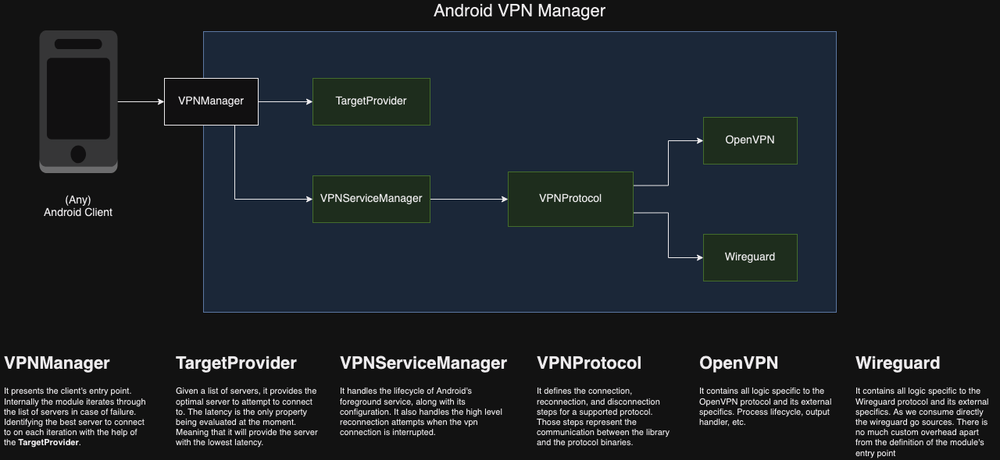

# Android VPNManager Module

Module offering to the Android clients VPN capabilities. It handles everything related to it, from the selection of optimal an optimal server given a list of them. To the managing of the OS service, communication with our services, and VPN protocol dependencies.


## Installation

### Requirements
- Git (latest)
- Android Studio (latest)
- Java 17

NOTE: On `darwin` we will need to install the following extra dependencies

- `flock` using `brew install flock`
- `sha256sum` using `brew install coreutils`

#### Download Codebase
Using the terminal:

`git clone git@gitlab.kape.com:kape/mobile/android/android-vpn-manager.git *folder-name*`

type in what folder we want to put in without the **

#### Library bundle

The library bundle can be found in the CI artifacts, along with the binary for the test application. Or, it can be build manually by doing the following:
* Generate the artifacts via `./gradlew clean vpnmanager:assemble`.
* The command above will output the generated artifacts on `/vpnmanager/build/outputs/aar`.

#### Setting up dependency

We use Maven for library publications (@see `/build.gradle` for its configuration).

As a client setting up the dependency on the module. We need to add the following to our gradle repositories in order to be able to resolve it. The `GITHUB_TOKEN` must have read packages permission.
```
maven {
    url = uri("https://maven.pkg.github.com/xvpn/kp_android_vpn_manager")
    credentials {
        username = "n/a"
        password = System.getenv("GITHUB_TOKEN")
    }
}
```
Next, we add the dependency to the module requiring as usual with any other dependency by doing:
```
implementation("com.kape.android:vpnmanager:0.1.1")
```

NOTE: For active development using a external application, we can deploy locally the changes via `./gradlew publishMavenPublicationToMavenLocal` which would put the publication in maven's local cache using the specified version.

## Usage
As a client of the package, our main points of interest are:

* [VPNManagerAPI](/vpnmanager/src/main/java/com/kape/vpnmanager/presenters/VPNManagerAPI.kt) - It presents the clients with the public capabilities of the module, and it is considered the main entry point of the module.
* [VPNManagerBuilder](/vpnmanager/src/main/java/com/kape/vpnmanager/presenters/VPNManagerBuilder.kt) - It offers to the client a way to build an instance of the module that conforms to the public interface [VPNManagerAPI](/vpnmanager/src/main/java/com/kape/vpnmanager/presenters/VPNManagerAPI.kt). It is also, where we set all the required client dependencies of the module.

An example on how building an instance of the module would look like is as follows:

```
val vpnManagerApi: VPNManagerAPI = VPNManagerBuilder()
            .setContext(this)
            .setClientCoroutineContext(Dispatchers.Main)
            .setDebugLoggingDependency([this](/vpnmanager/src/main/kotlin/com/kape/vpnmanager/presenters/VPNManagerBuilder.kt))
            .setPermissionsDependency([this](/vpnmanager/src/main/kotlin/com/kape/kapevpnmanager/presenters/VPNManagerBuilder.kt))
            .setProtocolLoggingDependency([this](/vpnmanager/src/main/kotlin/com/kape/vpnmanager/presenters/VPNManagerBuilder.kt))
            .build()
```

## Documentation

* [Confluence Documentation](https://polymoon.atlassian.net/wiki/spaces/AR/pages/2694971788/VPN+Manager+mobile)

## Maintainers

- Juan Docal - [tatostao](https://github.com/tatostao)

## License

This project is licensed under the [MIT (Expat) license](https://choosealicense.com/licenses/mit/), which can be found [here](/LICENSE).